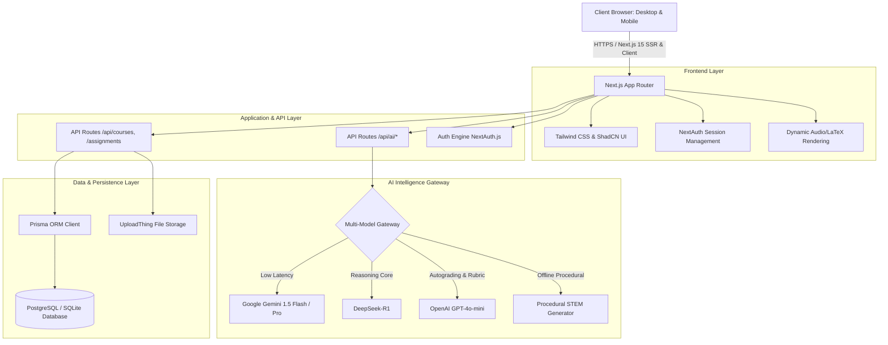

# 🚀 AI Powered Education Platform (EduPlatform AI)
### *Next-Generation Enterprise-Grade AI Learning, Examination & Autograding Infrastructure for Schools*

[](https://nextjs.org/)
[](https://react.dev/)
[](https://www.typescriptlang.org/)
[](https://tailwindcss.com/)
[](https://www.prisma.io/)
[](https://ai.google.dev/)
[](https://deepseek.com/)
[](https://openai.com/)
[](https://vercel.com/)

---

## 📑 Table of Contents
1. [🌟 Executive Overview](#-executive-overview)
2. [🏛️ Institutional Adaptability (Curricula & Range)](#️-institutional-adaptability-curricula--range)
3. [🤖 Core AI Academic Workflows](#-core-ai-academic-workflows)
4. [🧭 Platform Navigation & Architecture](#-platform-navigation--architecture)
5. [📄 72+ Compiled Pages & Site Map](#-72-compiled-pages--site-map)
6. [🔐 Demo Accounts & Authentication](#-demo-accounts--authentication)
7. [🛠️ Technology Stack & System Topology](#️-technology-stack--system-topology)
8. [💻 Quickstart Installation & Local Setup](#-quickstart-installation--local-setup)
9. [📜 Product Changelog & Release History](#-product-changelog--release-history)
10. [👨‍💻 Creator & Developer Contact](#-creator--developer-contact)
11. [📄 License](#-license)

---

## 🌟 Executive Overview

**AI Powered Education Platform** is an all-in-one licensable B2B academic intelligence ecosystem. It provides primary, secondary, and higher-education institutions with enterprise-grade AI learning capabilities without prohibitive enterprise pricing.

### Core Value Propositions:
- **Curriculum-Agnostic Intelligence**: Seamlessly configurable for Cambridge CAIE (O/A Levels), International Baccalaureate (IB), Edexcel, American AP, and national/provincial education board syllabi.
- **Interchangeable Multi-Model Gateway**: Dynamically routes prompts between Google Gemini 1.5 Flash (low latency), DeepSeek-R1 (advanced STEM & mathematical reasoning), and OpenAI GPT-4o (humanities & autograding).
- **Pedagogical Integrity**: Enforces strict Socratic inquiry guardrails that guide students step-by-step through checkpoints rather than spoiling final answers.
- **White-Label Institutional Deployment**: Customizable with institution subdomains, school crests, custom color themes, and departmental rubric configurations.
- **Zero-Data-Retention Privacy**: Compliant with international student data protection standards; student queries and coursework are never stored in public LLMs.

---

## 🏛️ Institutional Adaptability (Curricula & Range)

| Academic Tier | Target Audience | Key Platform Capabilities |
| :--- | :--- | :--- |
| **Primary & Elementary** *(Grades 1–5)* | Young Learners & Elementary Teachers | Visual foundational exercises, vocabulary builders, gamified badge achievements, and curiosity prompts. |
| **Middle & Secondary** *(Grades 6–10 / Matric)* | High School Students & Tutors | Socratic STEM problem solving, chapter summaries, science lab guides, and homework hints. |
| **College & Intermediate** *(O/A Levels & FSc)* | College Students & Lecturers | Timed practice arenas (20, 35, 50 questions), and differential calculus derivations. |
| **Undergraduate (BSc/BS/BE)** | University Students & TAs | Algorithm complexity analysis (Big-O), Python/JS syntax debugging, and autograding with rubric feedback. |
| **Postgraduate (MS/MPhil)** | Master's Scholars & Advisors | Advanced topic synthesis, technical essay evaluation, literature surveys, and originality/plagiarism checks. |
| **Faculty & Administrators** | Teachers, Professors & Deans | Automated grading queues, class performance analytics, grade adjustment reviews, and question bank generation. |

---

## 🤖 Core AI Academic Workflows

### 1. 🧠 Socratic AI Tutor (`/ai-tutor`)
- **Step-by-Step Inquiry**: Probes student understanding with scaffolded hints, preventing unearned answer duplication.
- **Full LaTeX & Code Typesetting**: Renders mathematical proofs, calculus derivatives, chemical reaction balances, and Python/JS code snippets with full syntax highlighting.
- **Multilingual Vernacular Support**: Supports prompt and response delivery in English, Urdu, Sindhi, Arabic, and regional languages.

### 2. ⚡ Adaptive Quiz Arena & Exam Simulator (`/quiz-generator`)
- **3-Tier Timed Exam Presets**:
  - 🏃 **Quick Sprint**: **20 Questions** (Time limit: **10 Minutes**)
  - 📋 **Standard Assessment**: **35 Questions** (Time limit: **17 Minutes**)
  - 🏆 **Comprehensive Exam**: **50 Questions** (Time limit: **25 Minutes**)
- **Zero-Collision Randomization**: Employs Fisher-Yates algorithmic shuffling to guarantee fresh question sets and non-repetitive distractor sequencing.
- **In-Quiz Socratic Hints**: On-demand conceptual hints that assist students during practice exams without penalizing final scores.
- **Diagnostic Scorecard**: Instant breakdown by topic mastery, answering speed, and step-by-step explanatory review.

### 3. 🤖 Formative Rubric Autograder (`/autograding`)
- **4-Tier Weighted Rubric**: Evaluates submissions across **Conceptual Understanding (40%)**, **Technical Depth (30%)**, **Critical Thinking (20%)**, and **Presentation & Structure (10%)**.
- **Personalized Revision Roadmaps**: Generates targeted growth action items for students before final submission.
- **Educator Verification Queue**: 1-click teacher score override and manual note attachment before grades are published.

### 4. 🔍 Originality & Plagiarism Detector (`/plagiarism`)
- **Deep Semantic & Syntactic Indexing**: Cross-compares student essays and code solutions against cohort repositories and AI synthesis patterns.
- **Zero Public LLM Storage**: Ensures student submissions remain confidential and are never used for third-party AI training.
- **Sentence-Level Reporting**: Clear percentage breakdowns separating valid citations, common formulae, and uncredited text.

### 5. 🎮 Gamified Academic Economy (`/leaderboard`)
- **XP Progression & Multipliers**: Rewards students for completed exercises, quiz completions, and Socratic dialogues.
- **Daily Study Streaks**: Multipliers that foster consistent daily study habits with anti-cheat streak validation.
- **Verifiable Digital Badges**: Merit awards including *STEM Pioneer*, *Calculus Master*, *Code Artisan*, and *Physics Ace*.

### 6. 📊 Educator Analytics & Compassionate Protocol (`/dashboard`, `/grade-requests`)
- **Cohort Mastery Telemetry**: Real-time class completion curves and automatic at-risk student intervention flags.
- **Compassionate Extension Requests**: Formalized, auditable student request queue for documented medical or personal emergencies.

---

## 🧭 Platform Navigation & Architecture

The platform features an ultra-clean, modern navigation interface:

### Navigation Bar:
```
[ OVERVIEW ]  [ AI WORKFLOWS ]  [ PRODUCT TOUR ]  [ PILOT PROCESS ]  [ DEVELOPER ]  [ CHANGELOG ]  [ FAQ ]
```

### Action Bar (Crimson Red Buttons):
```
[ CORE WORKFLOWS ]  [ HOW IT WORKS ]  [ CREATOR ]  [ REQUEST PILOT ]  [ LIVE DEMO ]
```

---

## 📄 72+ Compiled Pages & Site Map

The application consists of **72 production-compiled routes** organized into functional clusters:

### 1. Public & Institutional Portals
- `/` & `/home` - B2B AI Education Platform interactive demo landing page
- `/academic-excellence` - Curriculum standards & faculty credentials
- `/admissions-and-fees` - Admission overview & institutional tuition policies
- `/our-school` & `/our-school/facilities` - Campus infrastructure showcases
- `/our-school/primary-education` & `/our-school/secondary-education` - School curricula
- `/our-school/sixth-form` - College & A-Levels prep

### 2. Student & Educator Core Applications
- `/dashboard` - Personalized student & teacher command center
- `/courses` & `/courses/[id]` - Course catalog and individual syllabus modules
- `/assignments` & `/assignments-enhanced` - Homework submissions & status tracking
- `/autograding` - Formative autograding and rubric evaluation studio
- `/badges` - Achievement awards & badge gallery
- `/grade-requests` - Compassionate grade adjustment workflow
- `/grading` - Educator assessment & feedback queue
- `/leaderboard` - Student ranking & academic XP
- `/plagiarism` - Similarity & originality index analyzer
- `/settings` - Profile, preferences & account settings
- `/students` - Educator roster & student progress tracking
- `/submission-feedback` - Detailed instructor & AI rubrics

### 3. AI Learning Engines
- `/ai-hub` - Centralized AI Innovation & Technology Suite
- `/ai-tutor` - Socratic AI Mentor (Conversational guidance with LaTeX & Code)
- `/quiz-generator` - AI Quiz Arena & Exam Simulator (20, 35, 50 questions with timers)

### 4. Authentication & System Utilities
- `/auth/signin` - Role-based login portal
- `/auth/signup` - Student & Educator registration portal
- `/auth/error` - Auth error diagnosis & recovery

### 5. Backend REST API Endpoints
- `/api/ai/socratic-tutor` - Socratic dialogue processing (Gemini/GPT/DeepSeek)
- `/api/ai/quiz-generate` - Dynamic randomized 20/35/50 question generator
- `/api/ai/autograde` & `/api/ai/chat` & `/api/ai/insights` - AI feedback & analytics
- `/api/ai/award-points` - Gamified XP & study points transaction engine
- `/api/auth/[...nextauth]` & `/api/auth/register` - Authentication & user registration
- `/api/courses`, `/api/assignments`, `/api/submissions`, `/api/grades`, `/api/badges` - Core LMS data APIs

---

## 🔐 Demo Accounts & Authentication

For immediate live evaluation without manual registration, use these preconfigured credentials:

| Role | Email | Password | What You Can Access |
| :--- | :--- | :--- | :--- |
| **Student** | `student@eduplatform.edu` | `password` | Socratic Mentor, Quiz Arena, Course Enrollment, Submissions, Badges |
| **Educator** | `educator@eduplatform.edu` | `password` | Grading Queues, Autograding Config, Grade Adjustments, Analytics |

---

## 🛠️ Technology Stack & System Topology



---

## 💻 Quickstart Installation & Local Setup

### Prerequisites:
- **Node.js**: `v18.18+` or `v20+`
- **npm** (bundled with Node.js)
- **Git**

### Step-by-Step Instructions:

#### 1. Clone the Repository
```bash
git clone https://github.com/mhusman123/FYP-.git
cd FYP-
```

#### 2. Install Dependencies
```bash
npm install
```

#### 3. Configure Environment Variables
Create a `.env.local` file in the root directory:
```env
# Database Configuration
DATABASE_URL="file:./dev.db"

# NextAuth Configuration
NEXTAUTH_URL="http://localhost:3000"
NEXTAUTH_SECRET="eduplatform-ai-secret-key-2026-prod-fallback"

# AI Gateway API Keys
GEMINI_API_KEY="your-google-gemini-api-key"
AI_API_KEY="your-google-gemini-api-key"
OPENAI_API_KEY="your-openai-api-key"
DEEPSEEK_API_KEY="your-deepseek-api-key"

# Node Environment
NODE_ENV="development"
```

#### 4. Setup Prisma Database
```bash
npx prisma generate
npx prisma db push
```

#### 5. Launch the Development Server
```bash
npm run dev
```

Open your browser at:
👉 **[http://localhost:3000](http://localhost:3000)**

---

## 📜 Product Changelog & Release History

- **v2.4 (September 2026)**: AI Quiz Arena 3-Tier Timed Exam Simulator (20/35/50 questions) with Fisher-Yates zero-repetition randomization, live Socratic hints, and precise time management (10m, 17m, 25m).
- **v2.3 (August 2026)**: Multi-Model AI Gateway integrating Google Gemini 1.5 Flash, DeepSeek-R1 for deep mathematical proofs, and OpenAI GPT-4o.
- **v2.2 (August 2026)**: Formative Rubric Autograder v2 with 4-tier objective criteria and 1-click teacher grade adjustments.
- **v2.1 (July 2026)**: Originality & Semantic Plagiarism Scanner with Zero Public LLM data retention policy.
- **v2.0 (July 2026)**: Centralized AI Innovation Hub with single-pane navigation across 72+ modules and white-label branding.
- **v1.9 (June 2026)**: Gamified Merit Economy with daily study streaks, XP multipliers, and verified achievement badges.

---

## 👨‍💻 Creator & Developer Contact

**Muhammad Usman** — Creator & Lead AI Engineer  
- 📧 **Email**: [musmanmahar5312@gmail.com](mailto:musmanmahar5312@gmail.com)
- 💬 **WhatsApp**: [+92 305 8315292](https://wa.me/923058315292)
- 🐙 **GitHub**: [@mhusman123](https://github.com/mhusman123)
- 💼 **LinkedIn**: [muhammad-usman-9464b5247](https://www.linkedin.com/in/muhammad-usman-9464b5247/)
- 🐦 **X (Twitter)**: [@md_usman73](https://x.com/md_usman73)

---

## 📄 License
This project is licensed under the **MIT License** — open for academic, research, and pilot evaluation.
