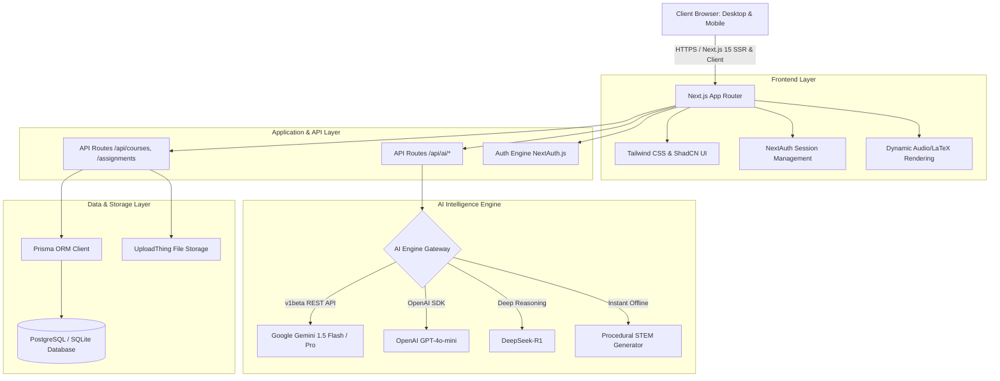

# 🎓 Sindh School of Technology (SST) & Universal AI EdTech Platform
### *An Next-Generation AI-Powered Educational, Research & Exam Simulation Ecosystem*

[](https://nextjs.org/)
[](https://react.dev/)
[](https://www.typescriptlang.org/)
[](https://tailwindcss.com/)
[](https://www.prisma.io/)
[](https://ai.google.dev/)
[](https://deepseek.com/)
[](https://openai.com/)
[](https://vercel.com/)

---

## 🌟 Executive Summary & Vision

The **Sindh School of Technology (SST) Universal EdTech Platform** was developed as a comprehensive Final Year Project (FYP) and engineered to evolve into a universal academic intelligence infrastructure. 

Designed to scale across **Schools, Colleges, and Universities**, the platform serves the entire academic journey—from **Grade 1 Primary students to Postdoctoral & PhD Researchers, Professors, Lecturers, and Institutional Leaders**.

By synthesizing state-of-the-art **Large Language Models (LLMs)**, **Socratic Pedagogical Engines**, **Dynamic Exam Simulators**, **Automated Rubric Autograders**, and **Gamified Academic Economics**, this platform democratizes world-class, personalized education while preserving regional cultural heritage (Indus Valley & Sindh Studies) and enabling multilingual digital transformation (English, Urdu, Sindhi).

---

## 🏛️ Comprehensive Academic Spectrum (Grade 1 to PhD)

| Academic Level | Target Audience | Primary Features & Modules Utilized |
| :--- | :--- | :--- |
| **Primary & Elementary** *(Grades 1–5)* | Young Learners & Teachers | Visual foundational exercises, interactive vocabulary, gamified badge rewards, curiosity prompts. |
| **Middle & High School** *(Grades 6–10 / Matric)* | Secondary Students & Tutors | Socratic STEM explanations, chapter summaries, science lab conceptual guides, homework hints. |
| **College & Intermediate** *(O/A Levels & FSc)* | College Students & Lecturers | MDCAT / ECAT exam simulators, 20/35/50 question timed challenges, differential calculus derivations. |
| **Undergraduate (BSc/BS/BE)** | University Students & TAs | Algorithm complexity analysis, Python/JS syntax debugging, autograding with rubric feedback. |
| **Postgraduate (MS/MPhil)** | Master's Scholars & Advisors | Advanced topic synthesis, literature survey structuring, technical essay evaluation, plagiarism checks. |
| **Doctoral & Postdoc (PhD)** | Researchers & Professors | Mathematical proofs, LaTeX formatting, research methodology critique, grant/proposal draft review. |
| **Educators & Professors** | Faculty & Evaluators | Automated assignment grading, class performance analytics, grade adjustment workflows, question bank generation. |

---

## 🚀 Key Architectural Features & Modules

### 1. 🧠 Socratic AI Mentor
- **Pedagogical Inquiry Over Spoilers**: Guided step-by-step reasoning that asks probing questions rather than dumping final answers.
- **Deep Domain Coverage**:
  - **Mathematics & Calculus**: Step-by-step differentiation (Chain/Product/Quotient rules), integration by parts, limits, and linear algebra with LaTeX rendering.
  - **Physics & Mechanics**: Classical Newtonian mechanics, wave optics, electricity, thermodynamics, and numerical problem solving.
  - **Chemistry & Materials**: Ionic vs covalent bonding, pH and buffer equilibrium, stoichiometry, and organic reaction mechanisms.
  - **Biology & Pre-Med**: Cellular respiration (ATP synthesis, ETC), molecular genetics (DNA/RNA transcription/translation), and human physiology.
  - **Computer Science & Coding**: Data structures (Hash Maps, BSTs, Graphs), Big-O asymptotic analysis, Python and JavaScript idiomatic patterns.
  - **Sindh Studies & History**: Mohenjo-daro urban planning, Kot Diji archaeology, and Sufi philosophy (*Shah Jo Risalo*, Sachal Sarmast).
- **Inquiry Reward System**: Students earn study points for engaging in critical inquiry and requesting conceptual hints.

### 2. ⚡ AI Quiz Arena & Exam Simulator
- **Dynamic 3-Tier Exam Mode**:
  - 🏃 **Quick Sprint**: **20 Questions** (Time limit: **10 Minutes** / 600s, up to 500 points)
  - 📋 **Standard Assessment**: **35 Questions** (Time limit: **17 Minutes** / 1020s, up to 875 points)
  - 🏆 **Comprehensive Exam**: **50 Questions** (Time limit: **25 Minutes** / 1500s, up to 1250 points)
- **Zero-Repetition Randomization**: Powered by Fisher-Yates shuffling and procedural STEM synthesis so questions and option orders are fresh on every single retake.
- **Socratic Hints on Demand**: In-quiz hints that guide students toward the answer without spoiling it.
- **Detailed Scorecard & Review**: Comprehensive post-test breakdown with pedagogical explanations for every question.

### 3. 🤖 AI Formative Feedback & Autograding Suite
- **Multi-Dimensional Rubrics**: Grades student submissions on Understanding (40%), Technical Depth (30%), Critical Thinking (20%), and Presentation (10%).
- **Code & Essay Analysis**: Analyzes logic errors, algorithmic complexity, syntax flaws, and structural coherence.
- **Constructive Growth Plan**: Provides students with targeted steps for revision and mastery before final submissions.

### 4. 🧭 Centralized AI Innovation Hub
- **Single-Pane-of-Glass Workspace**: Houses all active AI engines (Socratic Mentor, Quiz Arena, Formative Feedback) in one unified dashboard without cluttering navigation bars.
- **Future AI Previews**: Interactive preview slots for Speech-to-Text Vernacular Tutors, AR Lab Simulators, and LaTeX Research Assistants.

### 5. 🔍 Plagiarism & Academic Integrity Engine
- **Semantic Originality Scanning**: Detects text duplication, AI hallucination patterns, and uncredited citations.
- **Originality Index**: Generates percentage scores and flagged text passages for instructor review.

### 6. 🎮 Gamified Academic Economy
- **XP & Study Points**: Earn points for quizzes, homework submissions, and Socratic learning sessions.
- **Badges & Honors**: Unlock merit badges (e.g., *STEM Master*, *Calculus Conqueror*, *Code Artisan*, *History Scholar*).
- **Live Leaderboards**: Compete with peers across subjects to foster healthy academic motivation.

### 7. ⚖️ Grade Adjustment Request Protocol
- **Compassionate Evaluation**: Dedicated workflow allowing students facing illness, bereavement, or emergencies to request formal deadline extensions or grade re-evaluations with documented proof.
- **Educator Decision Dashboard**: Review, approve, or adjust scores transparently.

### 8. 🌐 Multi-Role Portals & Sindh Heritage Integration
- **Student Workspace**: Personalized course overview, assignment deadlines, AI tools, and progress analytics.
- **Educator Command Center**: Class management, grading queues, autograding configuration, and student intervention alerts.
- **Cultural Archive**: Integrated study units on Sindh's 5,000-year civilizational heritage, indigenous engineering, and literature.

---

## 🛠️ Technology Stack & System Architecture



### Core Technologies:
- **Framework**: [Next.js 15.5.25](https://nextjs.org/) (App Router, Server Components, Route Handlers)
- **UI & Styling**: [React 19](https://react.dev/), [Tailwind CSS](https://tailwindcss.com/), [ShadCN UI](https://ui.shadcn.com/), [Radix UI](https://www.radix-ui.com/), [Lucide Icons](https://lucide.dev/)
- **Programming Language**: [TypeScript 5](https://www.typescriptlang.org/)
- **Database ORM**: [Prisma ORM 6.16](https://www.prisma.io/)
- **Database Engines**: SQLite (Development) / PostgreSQL / Supabase (Production)
- **Authentication**: [NextAuth.js v4](https://next-auth.js.org/) (Credentials, Google OAuth, GitHub OAuth)
- **AI Models & Engines**: Google Gemini 1.5 Flash & Pro, OpenAI GPT-4o-mini, DeepSeek-R1, and Custom Procedural Question Bank

---

## 📁 Project Directory Structure

```
Sindhmitty/
├── prisma/
│   └── schema.prisma            # Database schemas (Users, Courses, Assignments, Submissions, Badges)
├── public/                      # Static assets, 4K illustrations, and logos
├── src/
│   ├── app/                     # Next.js App Router (72+ routes)
│   │   ├── (dashboard)/         # Protected student & educator dashboard routes
│   │   │   ├── ai-hub/          # Centralized AI Innovation & Learning Hub
│   │   │   ├── ai-tutor/        # Socratic AI Mentor (Conversational Interface)
│   │   │   ├── quiz-generator/  # AI Quiz Arena & Exam Simulator (20/35/50 Qs)
│   │   │   ├── assignments/     # Assignment submission & tracking
│   │   │   ├── autograding/     # AI Formative Feedback & Rubric grading
│   │   │   ├── badges/          # Gamification & achievement badges
│   │   │   ├── courses/         # Course catalogs & enrollment
│   │   │   ├── dashboard/       # Primary student/educator dashboard
│   │   │   ├── grade-requests/  # Grade adjustment protocol
│   │   │   ├── leaderboard/     # Academic leaderboard
│   │   │   ├── plagiarism/      # Originality & integrity scanner
│   │   │   └── settings/        # Profile & account configuration
│   │   ├── api/                 # Backend REST API routes
│   │   │   ├── ai/              # Socratic tutor, quiz generator, autograding endpoints
│   │   │   ├── auth/            # NextAuth authentication & user registration
│   │   │   ├── assignments/     # Assignment CRUD operations
│   │   │   ├── courses/         # Course management
│   │   │   └── submissions/     # File uploads & grade processing
│   │   └── (marketing)/         # Public school landing pages, admissions, and heritage
│   ├── components/              # Modular UI components & ShadCN elements
│   │   ├── navigation.tsx       # Universal responsive navigation bar & mobile drawer
│   │   ├── header.tsx           # Application topbar
│   │   └── ui/                  # Reusable UI primitives (Buttons, Cards, Dialogs, Selects)
│   ├── lib/                     # Utilities & Core Services
│   │   ├── ai-engine.ts         # Multi-model AI gateway & procedural question generator
│   │   ├── auth.ts              # NextAuth options & role guards
│   │   ├── prisma.ts            # Singleton Prisma client
│   │   └── utils.ts             # Utility helpers
│   └── types/                   # TypeScript type definitions
├── .env.example                 # Environment variable template
├── package.json                 # Project dependencies & scripts
├── tsconfig.json                # TypeScript compiler configuration
└── README.md                    # Platform documentation
```

---

## 💻 Installation & Quickstart

### Prerequisites:
- **Node.js**: v18.18+ or v20+
- **npm** or **yarn** / **pnpm**
- **Git**

### 1. Clone the Repository
```bash
git clone https://github.com/mhusman123/FYP-.git
cd FYP-
```

### 2. Install Dependencies
```bash
npm install
```

### 3. Configure Environment Variables
Create a `.env.local` file in the project root:
```env
# Database (SQLite for local development, PostgreSQL for production)
DATABASE_URL="file:./dev.db"

# NextAuth Configuration
NEXTAUTH_URL="http://localhost:3000"
NEXTAUTH_SECRET="your-super-secret-key-min-32-chars-long"

# AI Gateway API Keys (Gemini, OpenAI, DeepSeek)
GEMINI_API_KEY="your-google-gemini-api-key"
AI_API_KEY="your-google-gemini-api-key"
OPENAI_API_KEY="your-openai-api-key"
DEEPSEEK_API_KEY="your-deepseek-api-key"

# Node Environment
NODE_ENV="development"
```

### 4. Initialize Database & Generate Prisma Client
```bash
npx prisma generate
npx prisma db push
```

### 5. Launch Development Server
```bash
npm run dev
```
Open [http://localhost:3000](http://localhost:3000) in your browser to access the platform.

---

## 🔑 Test Accounts & Demo Credentials

| Role | Email | Password | Access Level |
| :--- | :--- | :--- | :--- |
| **Student** | `student@eduplatform.edu` | `password` | Socratic Tutor, Quiz Arena, Course Enrollment, Submissions, Badges |
| **Educator** | `educator@eduplatform.edu` | `password` | Grading Queue, Autograding Config, Grade Adjustments, Analytics |

---

## 🔮 Future Roadmap (Next Horizons for SST AI)

- [ ] **🎓 PhD & Research Paper Companion**: Automated literature synthesis, BibTeX generator, and methodology gap analysis for doctoral researchers.
- [ ] **🗣️ Multilingual Voice AI**: Real-time voice interaction and audio lectures in Sindhi, Urdu, and English with regional dialect support.
- [ ] **🧪 Virtual Reality (VR) / AR Science Labs**: 3D interactive physics kinematics, chemical titration, and biological dissection experiments in the browser.
- [ ] **🤝 Inter-University Knowledge Graph**: Cross-institutional collaboration hub for sharing research datasets, lecture notes, and peer reviews.
- [ ] **📶 Offline-First Edge AI**: Lightweight, quantized model deployments on Raspberry Pi / low-cost school servers for rural schools without stable internet.

---

## 👨‍💻 Author & Final Year Project Information

- **Developer**: Muhammad Usman & FYP Team
- **Project**: Final Year Project (FYP) — Sindh School of Technology (SST)
- **Repository**: [https://github.com/mhusman123/FYP-](https://github.com/mhusman123/FYP-)
- **Live Deployment**: Hosted on Vercel

---

## 📄 License
This project is developed for educational and research purposes under the **MIT License**.
