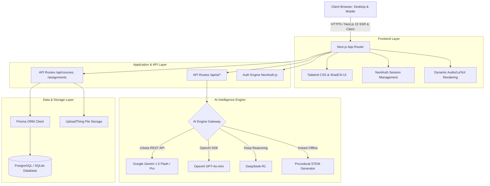

# 🎓 Sindh School of Technology (SST) & Universal AI EdTech Platform
### *An Next-Generation AI-Powered Educational, Research & Exam Simulation Ecosystem*

[](https://nextjs.org/)
[](https://react.dev/)
[](https://www.typescriptlang.org/)
[](https://tailwindcss.com/)
[](https://www.prisma.io/)
[](https://ai.google.dev/)
[](https://deepseek.com/)
[](https://openai.com/)
[](https://vercel.com/)

---

## 📑 Table of Contents
1. [🌟 Executive Summary & Vision](#-executive-summary--vision)
2. [🏛️ Comprehensive Academic Spectrum (Grade 1 to PhD)](#️-comprehensive-academic-spectrum-grade-1-to-phd)
3. [🚀 Core Architectural Features & Modules](#-core-architectural-features--modules)
4. [🧭 Platform Navigation & Button Anatomy](#-platform-navigation--button-anatomy)
5. [📄 Complete 72+ Pages Directory & Site Map](#-complete-72-pages-directory--site-map)
6. [🔐 Student & Educator Registration & Login Guide](#-student--educator-registration--login-guide)
7. [🤖 Step-by-Step Guide: How to Use All AI Features](#-step-by-step-guide-how-to-use-all-ai-features)
8. [🛠️ Technology Stack & System Architecture](#️-technology-stack--system-architecture)
9. [💻 Installation & How to Run the Platform](#-installation--how-to-run-the-platform)
10. [🔮 Future Roadmap (Next Horizons for SST AI)](#-future-roadmap-next-horizons-for-sst-ai)
11. [👨‍💻 Author & Final Year Project Information](#-author--final-year-project-information)

---

## 🌟 Executive Summary & Vision

The **Sindh School of Technology (SST) Universal EdTech Platform** was conceived and built as an advanced Final Year Project (FYP) and engineered to serve as a universal academic intelligence infrastructure for educational institutions worldwide.

Designed to scale seamlessly across **Schools, Colleges, and Universities**, the platform caters to learners and educators at every level:
- **School & College Students**: Conceptual STEM guidance, exam preparation (MDCAT/ECAT/O-A Levels), and homework autograding.
- **Undergraduate & Graduate Scholars**: Algorithm complexity analysis, code verification, and laboratory derivations.
- **PhD Candidates & Researchers**: Literature survey structuring, LaTeX math synthesis, and methodology critique.
- **Teachers, Lecturers & Professors**: Automated rubric grading, class analytics, dynamic test generation, and compassionate grade adjustment protocols.

---

## 🏛️ Comprehensive Academic Spectrum (Grade 1 to PhD)

| Academic Tier | Target Audience | Key Platform Capabilities |
| :--- | :--- | :--- |
| **Primary & Elementary** *(Grades 1–5)* | Young Learners & Elementary Teachers | Visual foundational exercises, vocabulary builders, gamified badge achievements, and curiosity prompts. |
| **Middle & Secondary** *(Grades 6–10 / Matric)* | High School Students & Tutors | Socratic STEM problem solving, chapter summaries, science lab guides, and homework hints. |
| **College & Intermediate** *(O/A Levels & FSc)* | College Students & Lecturers | MDCAT & ECAT timed practice arenas (20, 35, 50 questions), and differential calculus derivations. |
| **Undergraduate (BSc/BS/BE)** | University Students & TAs | Algorithm complexity analysis (Big-O), Python/JS syntax debugging, and autograding with rubric feedback. |
| **Postgraduate (MS/MPhil)** | Master's Scholars & Advisors | Advanced topic synthesis, technical essay evaluation, literature surveys, and originality/plagiarism checks. |
| **Doctoral & Postdoc (PhD)** | Researchers & Professors | Mathematical proofs with LaTeX rendering, research methodology critique, and grant/paper draft review. |
| **Faculty & Administrators** | Teachers, Professors & Deans | Automated grading queues, class performance analytics, grade adjustment reviews, and question bank generation. |

---

## 🚀 Core Architectural Features & Modules

### 1. 🧠 Socratic AI Mentor
- **Pedagogical Inquiry Over Spoilers**: Guided step-by-step reasoning that asks probing questions rather than dumping final answers.
- **Domain Coverage**:
  - **Mathematics & Calculus**: Step-by-step differentiation (Chain/Product/Quotient rules), integration by parts, limits, and linear algebra with LaTeX rendering.
  - **Physics & Mechanics**: Classical Newtonian mechanics, wave optics, electricity, thermodynamics, and numerical calculations.
  - **Chemistry & Materials**: Ionic vs covalent bonding, pH and buffer equilibrium, stoichiometry, and organic reaction mechanisms.
  - **Biology & Pre-Med**: Cellular respiration (ATP synthesis, ETC), molecular genetics (DNA/RNA transcription/translation), and human physiology.
  - **Computer Science & Coding**: Data structures (Hash Maps, BSTs, Graphs), Big-O asymptotic analysis, Python and JavaScript idiomatic patterns.
  - **Sindh Studies & History**: Mohenjo-daro urban planning, Kot Diji archaeology, and Sufi philosophy (*Shah Jo Risalo*, Sachal Sarmast).
- **Inquiry Reward System**: Students earn +10 study points for engaging in critical inquiry and requesting conceptual hints.

### 2. ⚡ AI Quiz Arena & Exam Simulator
- **Dynamic 3-Tier Exam Mode**:
  - 🏃 **Quick Sprint**: **20 Questions** (Time limit: **10 Minutes** / 600s, up to 500 points)
  - 📋 **Standard Assessment**: **35 Questions** (Time limit: **17 Minutes** / 1020s, up to 875 points)
  - 🏆 **Comprehensive Exam**: **50 Questions** (Time limit: **25 Minutes** / 1500s, up to 1250 points)
- **Zero-Repetition Randomization**: Powered by Fisher-Yates shuffling and procedural STEM synthesis so questions and option orders are fresh on every single retake or page refresh.
- **Socratic Hints on Demand**: In-quiz hints that guide students toward the answer without spoiling it.
- **Detailed Scorecard & Review**: Comprehensive post-test breakdown with pedagogical explanations for every question.

### 3. 🤖 AI Formative Feedback & Autograding Suite
- **Multi-Dimensional Rubrics**: Grades student submissions on Understanding (40%), Technical Depth (30%), Critical Thinking (20%), and Presentation (10%).
- **Code & Essay Analysis**: Analyzes logic errors, algorithmic complexity, syntax flaws, and structural coherence.
- **Constructive Growth Plan**: Provides students with targeted steps for revision and mastery before final submissions.

### 4. 🧭 Centralized AI Innovation Hub
- **Single-Pane-of-Glass Workspace**: Houses all active AI engines (Socratic Mentor, Quiz Arena, Formative Feedback) in one unified dashboard without cluttering navigation bars.
- **Future AI Previews**: Interactive preview slots for Speech-to-Text Vernacular Tutors, AR Lab Simulators, and LaTeX Research Assistants.

### 5. 🔍 Plagiarism & Academic Integrity Engine
- **Semantic Originality Scanning**: Detects text duplication, AI hallucination patterns, and uncredited citations.
- **Originality Index**: Generates percentage scores and flagged text passages for instructor review.

### 6. 🎮 Gamified Academic Economy
- **XP & Study Points**: Earn points for quizzes, homework submissions, and Socratic learning sessions.
- **Badges & Honors**: Unlock merit badges (e.g., *STEM Master*, *Calculus Conqueror*, *Code Artisan*, *History Scholar*).
- **Live Leaderboards**: Compete with peers across subjects to foster healthy academic motivation.

### 7. ⚖️ Grade Adjustment Request Protocol
- **Compassionate Evaluation**: Dedicated workflow allowing students facing illness, bereavement, or emergencies to request formal deadline extensions or grade re-evaluations with documented proof.
- **Educator Decision Dashboard**: Review, approve, or adjust scores transparently.

---

## 🧭 Platform Navigation & Button Anatomy

The platform features an ultra-clean, unified navigation architecture. On both desktop and mobile screens, exactly **8 primary navigation buttons** remain organized and consistent:

```
[ HOME ]  [ DASHBOARD ]  [ COURSES ]  [ ASSIGNMENTS ]  [ AI HUB ]  [ AUTOGRADING ]  [ LEADERBOARD ]  [ SETTINGS ]
```

### Main Navigation Bar Buttons:
1. **🏠 `HOME` (`/home` or `/`)**:
   - **What you see**: Public institutional landing page with 4K campus photography, academic excellence highlights, admissions workflow, and Sindh heritage showcases.
2. **📊 `DASHBOARD` (`/dashboard`)**:
   - **What you see**: The student's command center displaying active enrolled courses, upcoming assignment deadlines, announcements, study points, and quick action cards.
3. **📚 `COURSES` (`/courses`)**:
   - **What you see**: Course catalog and syllabus browser. Students can browse, enroll in STEM & Humanities courses, view instructors, and download lecture materials.
4. **📝 `ASSIGNMENTS` (`/assignments`)**:
   - **What you see**: Homework tracking portal. View active, submitted, and overdue assignments with deadline countdowns and file attachment upload tools.
5. **✨ `AI HUB` (`/ai-hub`)**:
   - **What you see**: The centralized AI Innovation Hub housing live launchpads for **Socratic AI Mentor**, **AI Quiz Arena**, and **AI Feedback**, plus previews of upcoming research tools.
6. **🤖 `AUTOGRADING` (`/autograding`)**:
   - **What you see**: Formative autograding studio. Paste code snippets or essay drafts to receive immediate rubric-based scores and constructive feedback.
7. **🏆 `LEADERBOARD` (`/leaderboard`)**:
   - **What you see**: Gamified ranking board showing student XP, study streaks, and earned badges across subject domains.
8. **⚙️ `SETTINGS` (`/settings`)**:
   - **What you see**: Profile configuration, account security, theme preferences (Dark/Light mode), and notification preferences.

### Topbar Action Buttons:
- **🌓 Theme Toggle**: Instant seamless switching between dark mode and light mode.
- **👤 User Profile & Sign Out**: Displays active user name, role badge (`Student` or `Educator`), and secure logout button.
- **🔑 Sign In / Sign Up**: Accessible for guests to authenticate or create new accounts.

### Floating Action Buttons (Accessible on Every Dashboard Page):
- **💡 Bottom-Left Floating Button (`Socratic AI Mentor`)**: Instant floating launcher that takes the student directly to the Socratic AI Mentor conversation.
- **🤖 Bottom-Right Floating Button (`AI Assistant`)**: Quick popup modal for instant answers and student support.

---

## 📄 Complete 72+ Pages Directory & Site Map

The application consists of **72 production-compiled routes** organized into functional clusters:

### 1. Public & Institutional Portals (18 Pages)
- `/` & `/home` - Main institutional landing page
- `/academic-excellence` - Curriculum standards & faculty credentials
- `/admissions-and-fees` - Admission overview & tuition policies
- `/admissions-and-fees/admissions-process` - Step-by-step enrollment guide
- `/admissions-and-fees/open-days-and-visits` - Campus tour booking
- `/admissions-and-fees/school-fees` - Transparent fee structure
- `/our-school` & `/our-school/school-information` - Campus mission & leadership
- `/our-school/facilities` - 4K showcases of labs, libraries, and sports pavilion
- `/our-school/early-years-foundation-stage` - Early childhood education
- `/our-school/primary-education` - Primary school curriculum
- `/our-school/secondary-education` - Secondary & Matric stream
- `/our-school/sixth-form` - College & A-Levels prep
- `/our-school/your-childs-journey` - Holistic student development milestones
- `/our-school/blog` & `/our-school/school-news` - Campus updates and events
- `/sindh-education` - Dedicated archive on Sindh history & Indus civilization
- `/why-choose-us` (with 6 subpages: Cognita family, Community, Digital learning, Extra-curricular, Values, Wellbeing)

### 2. Student & Educator Core Applications (14 Pages)
- `/dashboard` - Personalized student & teacher portal
- `/courses` & `/courses/[id]` - Course catalog and individual course modules
- `/assignments` & `/assignments-enhanced` - Homework submissions & status
- `/autograding` - AI formative feedback engine
- `/badges` - Achievement awards & badge gallery
- `/grade-requests` - Compassionate grade adjustment workflow
- `/grading` - Educator assessment & feedback queue
- `/leaderboard` - Student ranking & academic XP
- `/plagiarism` - Similarity & originality index analyzer
- `/settings` - Profile, preferences & account settings
- `/students` - Educator roster & student progress tracking
- `/submission-feedback` - Detailed instructor & AI rubrics

### 3. AI Learning Engines (3 Pages)
- `/ai-hub` - Centralized AI Innovation & Technology Suite
- `/ai-tutor` - Socratic AI Mentor (Conversational guidance with LaTeX & Code)
- `/quiz-generator` - AI Quiz Arena & Exam Simulator (20, 35, 50 questions with timers)

### 4. Authentication & System Utilities (6 Pages)
- `/auth/signin` - Role-based login portal
- `/auth/signup` - Student & Educator registration portal
- `/auth/error` - Auth error diagnosis & recovery
- `/auth-test` & `/login-debug` - Diagnostic authentication testing
- `/registration-test` - Live database registration verification

### 5. Backend REST API Endpoints (31 Routes)
- `/api/ai/socratic-tutor` - Socratic dialogue processing (Gemini/GPT/DeepSeek)
- `/api/ai/quiz-generate` - Dynamic randomized 20/35/50 question generator
- `/api/ai/autograde` & `/api/ai/chat` & `/api/ai/insights` - AI feedback & analytics
- `/api/ai/award-points` - Gamified XP & study points transaction engine
- `/api/auth/[...nextauth]` & `/api/auth/register` - Authentication & user registration
- `/api/courses`, `/api/assignments`, `/api/submissions`, `/api/grades`, `/api/badges` - Core LMS data APIs

---

## 🔐 Student & Educator Registration & Login Guide

### How to Create a New Account (Sign Up):
1. Navigate to **[http://localhost:3000/auth/signup](http://localhost:3000/auth/signup)** or click **"Register"** in the top-right corner.
2. Fill out the registration form:
   - **Full Name**: Enter your name (e.g. *Ali Khan* or *Dr. Sarah Ahmed*).
   - **Email Address**: Enter a valid academic or personal email.
   - **Password**: Create a secure password.
   - **Account Role**: Select **Student** or **Educator / Teacher**.
3. Click **"Create Account"**. Your profile is instantly registered and persisted in the Prisma database.
4. You will be automatically redirected to sign in.

### How to Sign In:
1. Navigate to **[http://localhost:3000/auth/signin](http://localhost:3000/auth/signin)**.
2. Enter your email and password.
3. Click **"Sign In"**. NextAuth securely authenticates your session and redirects you to your personalized dashboard.

### Ready-to-Use Demo Test Accounts:
For instant evaluation without creating a new account, use these preconfigured test credentials:

| Role | Email | Password | What You Can Access |
| :--- | :--- | :--- | :--- |
| **Student** | `student@eduplatform.edu` | `password` | Socratic Mentor, Quiz Arena, Course Enrollment, Submissions, Badges |
| **Educator** | `educator@eduplatform.edu` | `password` | Grading Queues, Autograding Config, Grade Adjustments, Analytics |

---

## 🤖 Step-by-Step Guide: How to Use All AI Features

### 1. Using the Socratic AI Mentor (`/ai-tutor`)
1. Click **"AI HUB"** in the navigation bar, then select **"Open Socratic Mentor"** (or click the bottom-left floating button).
2. **Select your AI Reasoning Engine**: Choose between *GPT-4o-mini (Fast Socratic)*, *DeepSeek-R1 (Deep Math/Logic)*, or *Gemini 1.5 Flash*.
3. **Select your Subject Area**: Pick *CS & Mathematics*, *Physics*, *Chemistry*, *Biology*, or *Sindh Studies*.
4. **Type your Question**: For example:
   - *Math*: "How do I differentiate y = (3x^2 + 5)^4 using the Chain Rule?"
   - *Biology*: "What is the role of ATP Synthase in the electron transport chain?"
   - *Chemistry*: "Why is water a polar molecule while CO2 is non-polar?"
   - *Physics*: "If a satellite orbits Earth at constant speed, why is it accelerating?"
   - *CS*: "How do Hash Maps resolve hash collisions in Python?"
   - *Sindh Studies*: "Explain the urban sanitation system of Mohenjo-daro."
5. **Interactive Guidance**: The mentor provides formulas, concepts, and asks a probing question to guide your thinking. Click any of the **Suggested Follow-up Chips** to continue exploring!

### 2. Launching the AI Quiz Arena (`/quiz-generator`)
1. Click **"Launch Quiz Arena"** from the AI Hub or the top banner.
2. **Configure your Exam**:
   - **Subject**: Choose your discipline.
   - **Topic**: Type any specific chapter (e.g. *Derivatives, Newton's Laws, Python BSTs*).
   - **Difficulty**: Choose *Beginner*, *Intermediate (O/A Levels & FSc)*, or *Advanced (MDCAT/ECAT)*.
   - **Question Tier**:
     - **20 Questions** (Quick Sprint - 10 Minutes timer)
     - **35 Questions** (Standard Assessment - 17 Minutes timer)
     - **50 Questions** (Comprehensive Exam - 25 Minutes timer)
3. Click **"Generate AI Quiz & Start Challenge"**.
4. **Take the Test**:
   - Watch the live timer countdown.
   - Click **"Need a Socratic Hint?"** if you are stuck.
   - Select your answers and click **"Next Question"**.
5. **Submit & Review**:
   - View your total score percentage and points earned (+25 pts per correct answer).
   - Click **"Claim Points"** to add points to your leaderboard profile.
   - Review comprehensive academic explanations for every question.

### 3. Using the AI Formative Feedback & Autograder (`/autograding`)
1. Click **"AUTOGRADING"** in the navigation bar.
2. Paste your assignment essay draft or programming source code into the editor.
3. Select the evaluation rubric parameters.
4. Click **"Evaluate Submission"** to receive an instant breakdown of your strengths, logical gaps, and recommended revisions.

---

## 🛠️ Technology Stack & System Architecture



---

## 💻 Installation & How to Run the Platform

### Prerequisites:
- **Node.js**: v18.18+ or v20+
- **npm** (included with Node.js)
- **Git**

### Step-by-Step Execution:

#### 1. Clone the Repository
```bash
git clone https://github.com/mhusman123/FYP-.git
cd FYP-
```

#### 2. Install Project Dependencies
```bash
npm install
```

#### 3. Setup Environment Variables
Create a `.env.local` file in the root directory:
```env
# Database
DATABASE_URL="file:./dev.db"

# NextAuth Configuration
NEXTAUTH_URL="http://localhost:3000"
NEXTAUTH_SECRET="sindh-school-secret-key-2026-prod-fallback"

# AI Gateway API Keys
GEMINI_API_KEY="your-google-gemini-api-key"
AI_API_KEY="your-google-gemini-api-key"
OPENAI_API_KEY="your-openai-api-key"
DEEPSEEK_API_KEY="your-deepseek-api-key"

# Development Mode
NODE_ENV="development"
```

#### 4. Initialize Database Schema
```bash
npx prisma generate
npx prisma db push
```

#### 5. Start the Development Server
```bash
npm run dev
```

Open your browser and navigate to:
👉 **[http://localhost:3000](http://localhost:3000)**

---

## 🔮 Future Roadmap (Next Horizons for SST AI)

- [ ] **🎓 PhD & Research Paper Companion**: Automated literature synthesis, BibTeX generator, and methodology gap analysis for doctoral researchers.
- [ ] **🗣️ Multilingual Voice AI**: Real-time voice interaction and audio lectures in Sindhi, Urdu, and English with regional dialect support.
- [ ] **🧪 Virtual Reality (VR) / AR Science Labs**: 3D interactive physics kinematics, chemical titration, and biological dissection experiments in the browser.
- [ ] **🤝 Inter-University Knowledge Graph**: Cross-institutional collaboration hub for sharing research datasets, lecture notes, and peer reviews.
- [ ] **📶 Offline-First Edge AI**: Lightweight, quantized model deployments on Raspberry Pi / low-cost school servers for rural schools without stable internet.

---

## 👨‍💻 Author & Final Year Project Information

- **Developer**: Muhammad Usman & FYP Team
- **Project**: Final Year Project (FYP) — Sindh School of Technology (SST)
- **Repository**: [https://github.com/mhusman123/FYP-](https://github.com/mhusman123/FYP-)
- **Live Deployment**: Hosted on Vercel

---

## 📄 License
This project is developed for educational and research purposes under the **MIT License**.
